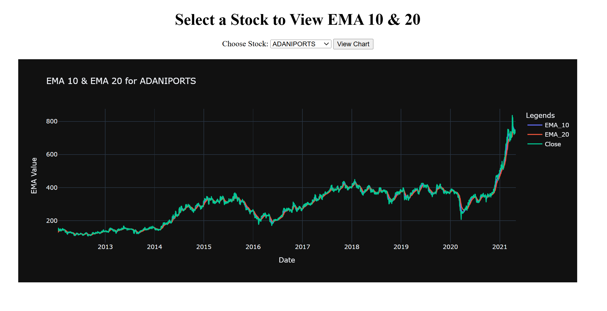
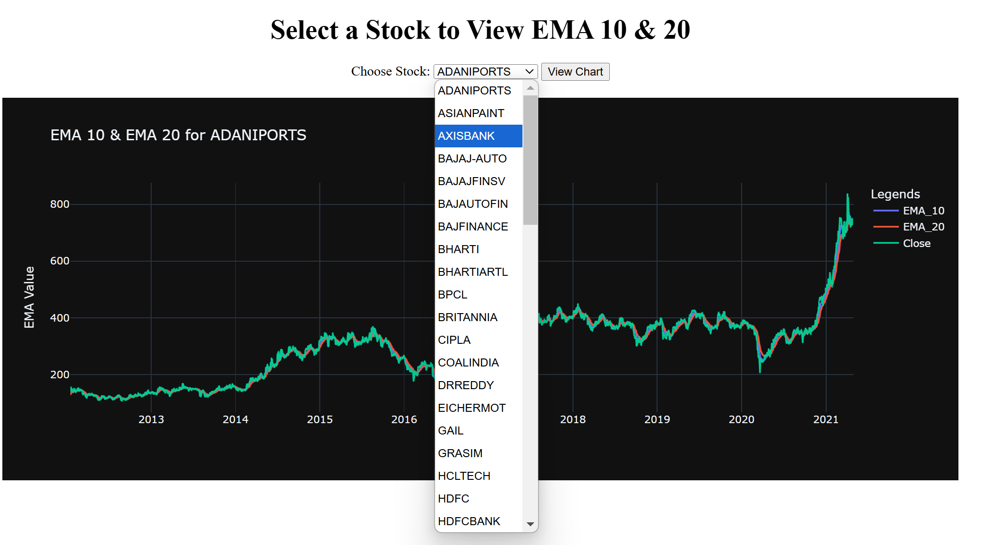
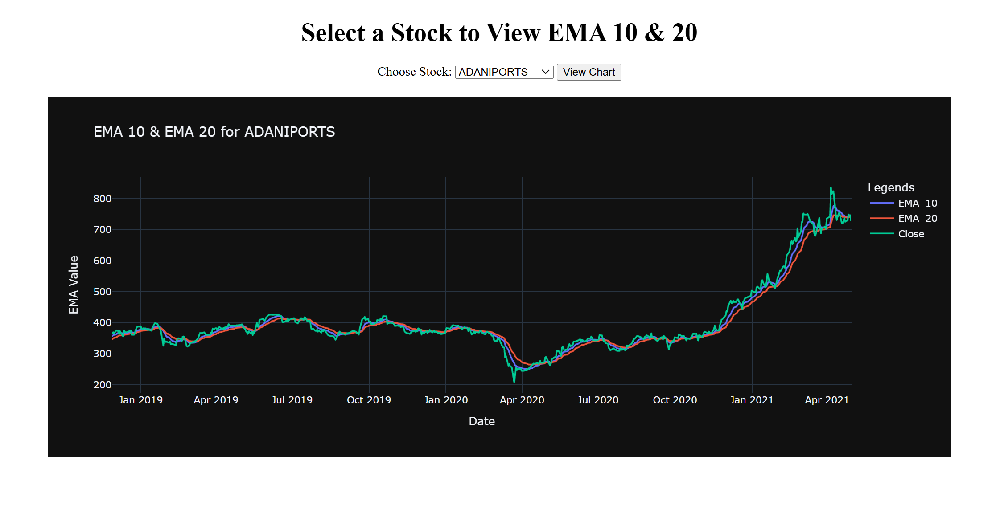
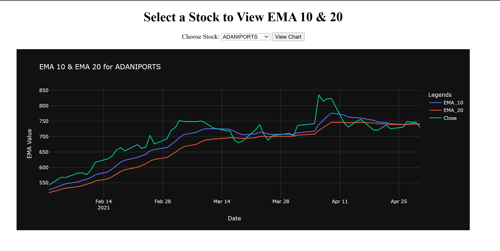

# Stock Market EMA Crossover Analysis

📈 **Stock Market EMA Crossover** is a Flask-based web application that allows users to visualize stock price movements and Exponential Moving Average (EMA) crossovers using **Plotly** charts. The dataset contains stock prices from **2000 to 2021**, sourced from **Kaggle**.

## 🚀 Features
- 📊 **Interactive Stock Price Charts** with EMA 10 & EMA 20 indicators.
- 🗂 **Data stored in SQLite database** instead of CSV for better performance.
- 🖥 **Web-based Interface** using Flask, HTML, CSS, and Plotly.
- 🔄 **Live Filtering**: Select stock symbols dynamically.
- 📡 **API Endpoint** to fetch stock data in JSON format.

---
## 📂 Project Structure
```plaintext
├── app.py          # Main Flask application
├── db.py           # Script to create SQLite database and load CSV data
├── stocks.csv      # Kaggle dataset (2000-2021)
├── templates/
│   ├── index.html  # Webpage UI
├── static/
│   ├── style.css   # Styling for UI
└── README.md       # Project documentation
```

---
## 📦 Installation
### **1️⃣ Clone the Repository**
```sh
git clone https://github.com/your-username/stock-ema-crossover.git
cd stock-ema-crossover
```

### **2️⃣ Create & Activate Virtual Environment** (Recommended)
```sh
python -m venv venv  # Create virtual environment
source venv/bin/activate  # For macOS/Linux
venv\Scripts\activate  # For Windows
```

### **3️⃣ Install Dependencies**
```sh
pip install -r requirements.txt
```

### **4️⃣ Setup Database**
```sh
python db.py  # This will create an SQLite database and load stock data
```

---
## 🏃‍♂️ Running the Application
```sh
python app.py
```
🔹 Open the browser and go to: `http://127.0.0.1:5000/`

---
## 🔗 API Endpoint
You can fetch stock data in JSON format using:
```
GET /get_chart?symbol=TSLA  # Example for Tesla stock
```
Response format:
```json
{
  "data": [
    { "x": ["2021-01-01", "2021-01-02"], "y": [120, 122], "name": "Close Price" },
    { "x": ["2021-01-01", "2021-01-02"], "y": [118, 121], "name": "EMA 10" }
  ]
}
```

---
## 🖼 Screenshots
📌 **Homepage with Stock Selection**


📌 **Stock Selection**


📌 **2 Year Data**


📌 **2 Months Data**



(*Make sure to save screenshots inside a `screenshots/` folder*)

---
## 📝 Future Enhancements
- 📊 **More Technical Indicators** (RSI, MACD, Bollinger Bands)
- ⏳ **Real-Time Stock Data** (Using an API like Alpha Vantage, Yahoo Finance)
- 🔔 **Alert System for EMA Crossovers**

---
## 🛠 Technologies Used
- **Python** (Flask, Pandas, SQLite3)
- **Plotly** (Graph Visualization)
- **HTML, CSS, JavaScript** (Frontend)
- **SQLite** (Database)

---
## 🤝 Contributing
Feel free to submit a Pull Request if you want to improve the project! 🚀

---
## 📜 License
This project is open-source and available under the **MIT License**.

